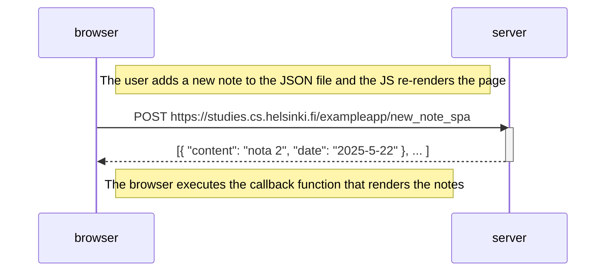

```mermaid
sequenceDiagram
    participant browser
    participant server

    Note right of browser: The user adds a new note to the JSON file and the JS re-renders the page

    browser->>server: POST https://studies.cs.helsinki.fi/exampleapp/new_note_spa
    activate server
    server-->>browser: [{ "content": "nota 2", "date": "2025-5-22" }, ... ]
    deactivate server

    Note right of browser: The browser executes the callback function that renders the notes
```
